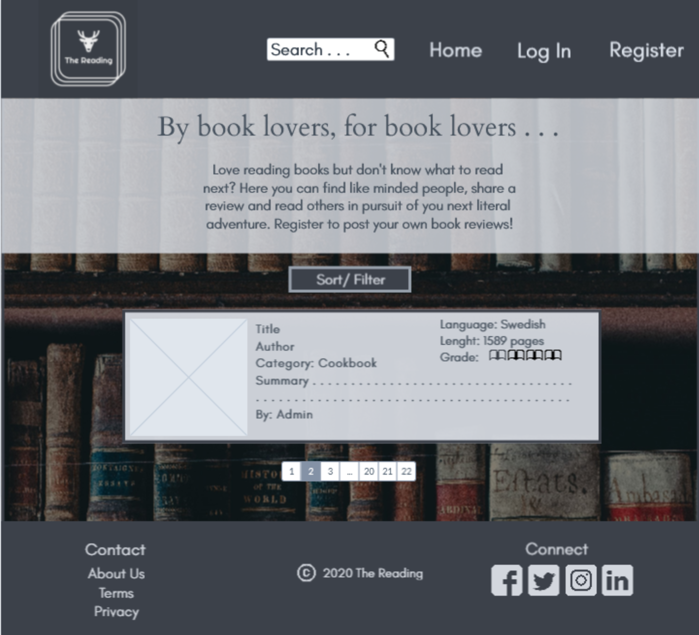
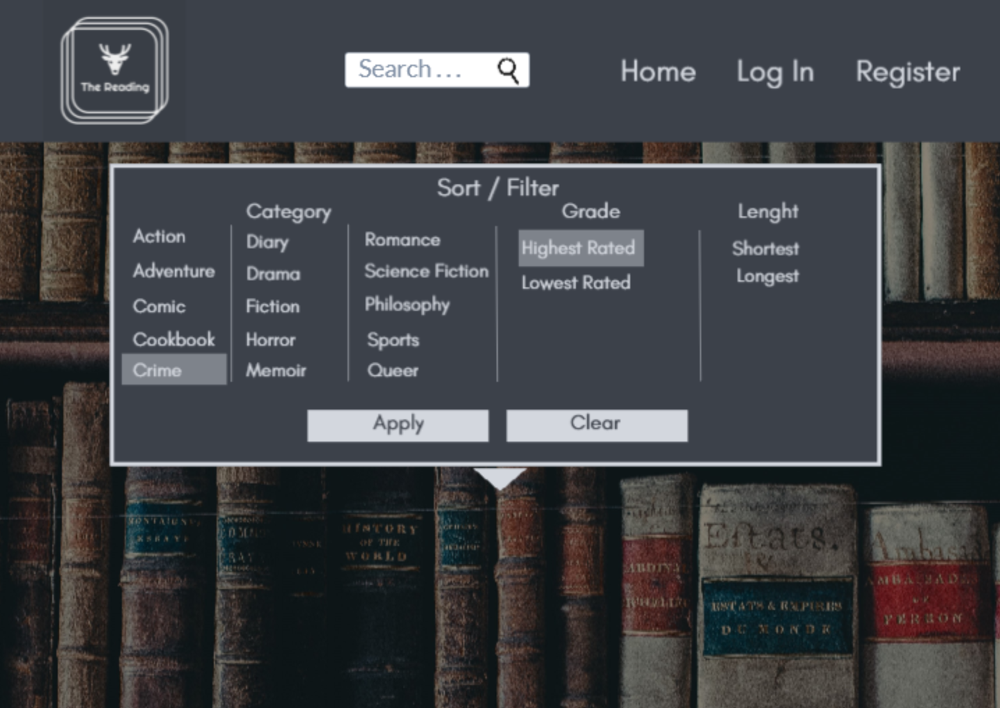
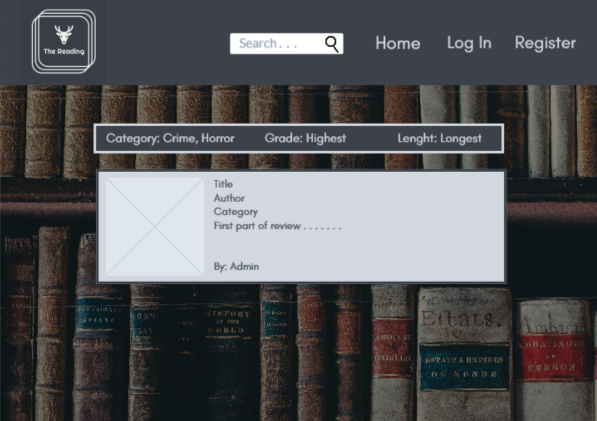
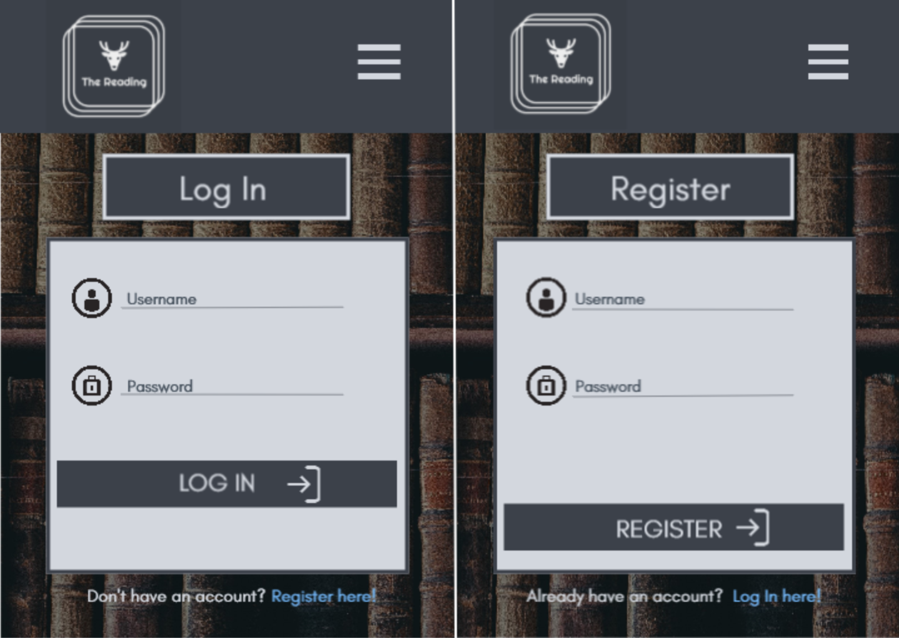
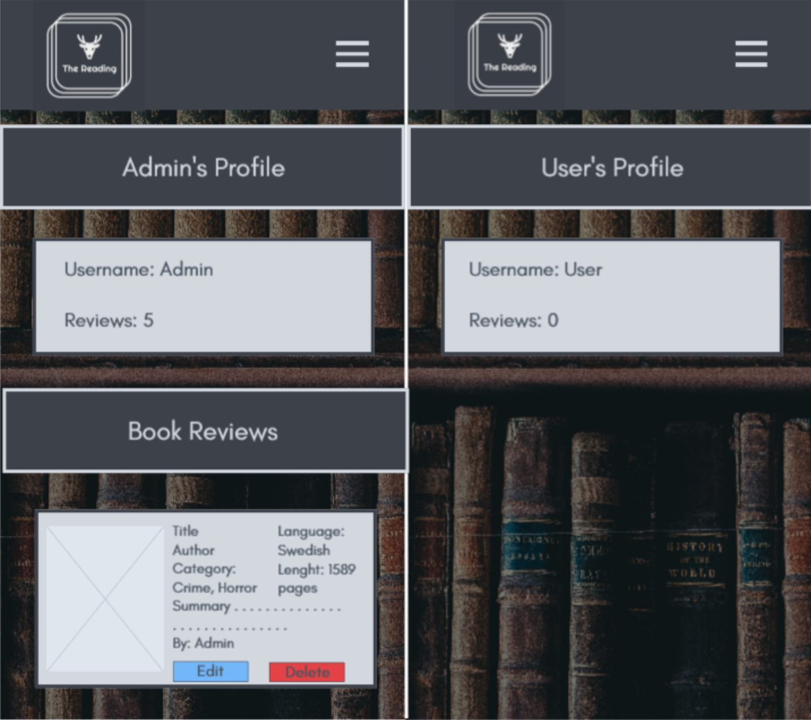
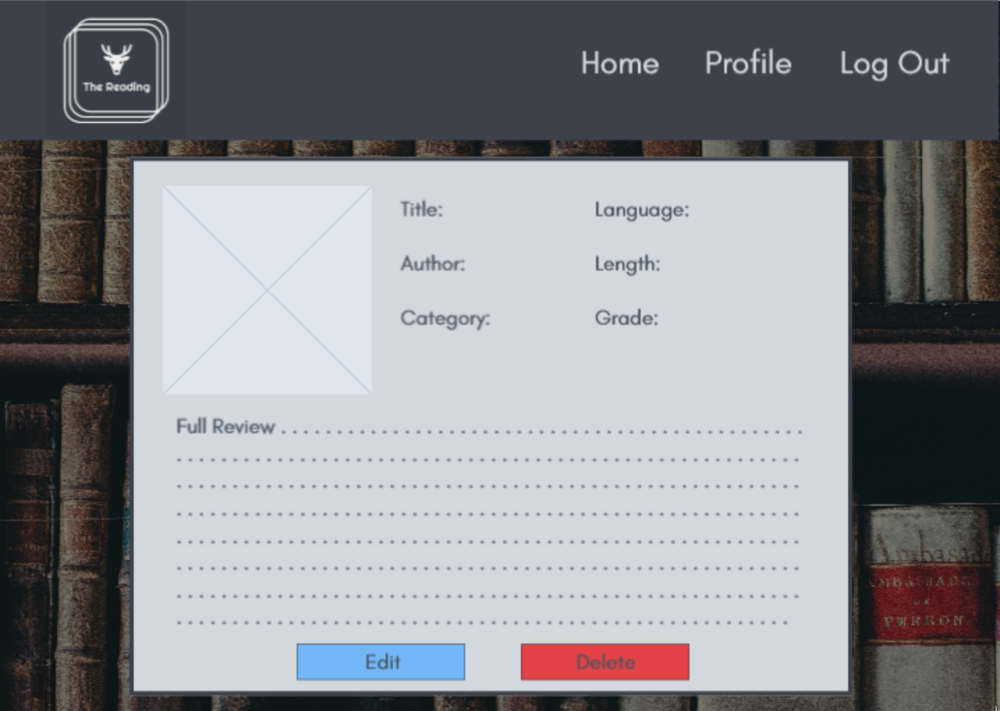
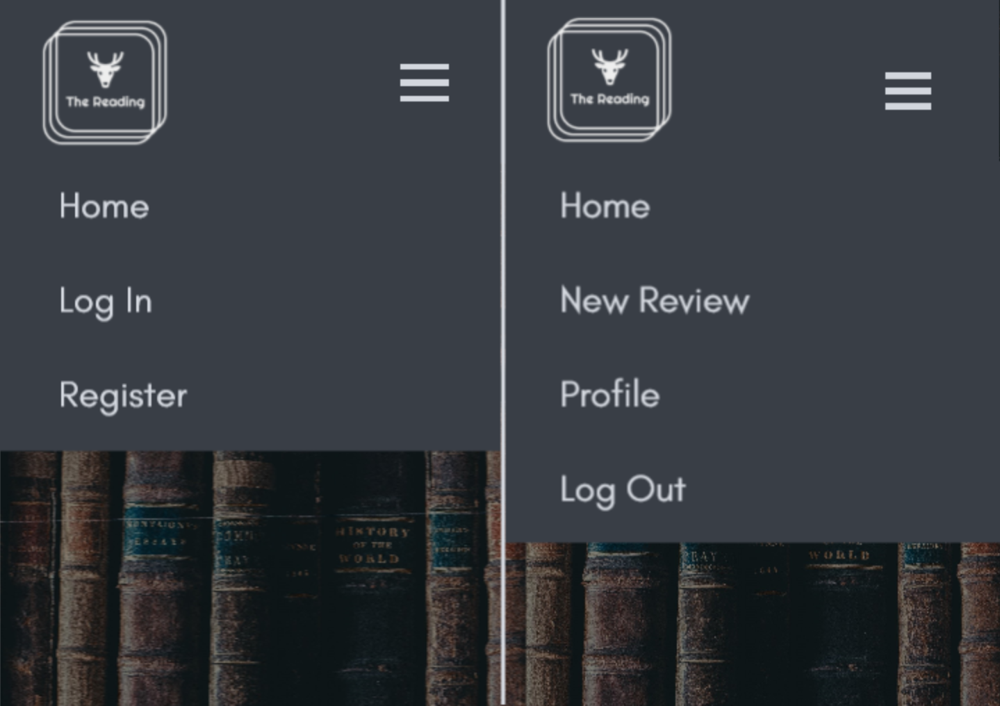
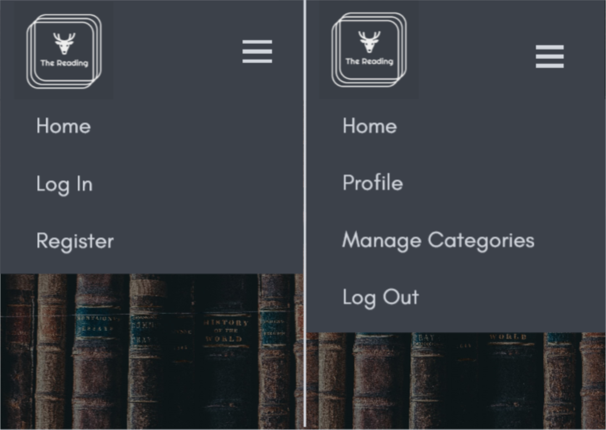

# The Reading
Welcome to the MoMo README file.

This is a school project with the main focus to display my skills in HTML, CSS, JavaScript,
Python, Flask, MongoDB and Materialize. This website's goal is for users to create, read,
update and delete book reviews. Also for the owner/owners to include affiliated sales links
to monetize the webpage and make a profit through the webpages popularity and usage. 

## UX/UI

### User Stories (UX)

As a user type, I want:

-   to be able to create, read, update and delete book reviews.

-	the webpage to be intuitive, to make usage easier and more appealing.

-   to see clear separations between my own book reviews and others.

-	to be able to purchase the book either directly via the webpage or through affiliated links.

### Owner Stories (UX)

As an owner type, I want:

-   to create a webpage that will allow users and owners to create, read, update and delete book reviews.

-   the webpage to be intuitive and appealing, which in turn will make the user want to use it
    on several accounts.

-   to be able to monetize the webpage by providing users with either selling the book directly
    on the webpage or by adding affiliated links.

### Wireframes (UI)

## Features

### Existing Features

### Features Left to Implement

- Future implementetion that would increase monetization would be to add adds to the webpage. That is not
the current focus with this project and therefore not Implemented.

## Technologies Used

### Languages

### Framework

### Library

### Other Technologies

## Testing

### Manual Testing

### Webpage images

### W3C vaildator

### w3 validator

### jshint

### Automated Testing

### Bugs fixed

### Known issues

## Deployment

## Credits

Book reviews:

- Review description summary for the book Frankenstein:
[www.wikipedia.org/frankenstein](https://en.wikipedia.org/wiki/Frankenstein)

- Review description summary for the book Dr. Jekyll and Mr. Hyde:
[www.bbc.co.uk](https://www.bbc.co.uk/bitesize/guides/z88wjxs/revision/1)

- Review description summary for the book Dracula:
[www.wikipedia.org/dracula](https://en.wikipedia.org/wiki/Dracula)

- Review description summary for the book Alice in Wonderland:
[en.wikipedia.org](https://en.wikipedia.org/wiki/Alice%27s_Adventures_in_Wonderland)

Code:

- Code for date in python was retrived from w3schools.com
[www.w3schools.com](https://www.w3schools.com/python/python_datetime.asp)

- Integer converter retrived from careerkarma.com
[careerkarma.com](https://careerkarma.com/blog/python-string-to-int/)

- Range for jinja was adapted from jinja.palletsprojects.com
[jinja.palletsprojects.com](https://jinja.palletsprojects.com/en/2.11.x/templates/)

### Content

### Media

#### Images

### Acknowledgements

This project received inspiration for this project from 3 following websites:

- [Readsy](https://reedsy.com/discovery/blog/book-review-examples)
- [Bookpage](https://bookpage.com/reviews?page=2)
- [Goodreads](https://www.goodreads.com/)

