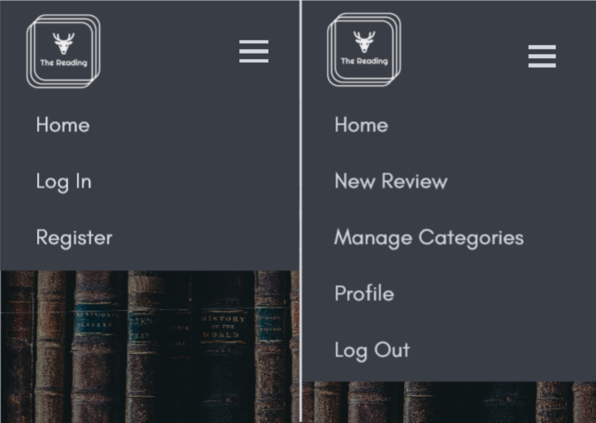

# The Reading
Welcome to the MoMo README file.

This is a school project with the main focus to display my skills in HTML, CSS, JavaScript,
Python, Flask, MongoDB and Materialize. This website's goal is for users to create, read,
update and delete book reviews. Also for the owner/owners to include affiliated sales links
to monetize the webpage and make a profit through the webpages popularity and usage. 

## UX/UI

### User Stories (UX)

As a user type, I want:

-   to be able to create, read, update and delete book reviews.

-	the webpage to be intuitive, to make usage easier and more appealing.

-   to see clear separations between my own book reviews and others.

-	to be able to purchase the book either directly via the webpage or through affiliated links.

### Owner Stories (UX)

As an owner type, I want:

-   to create a webpage that will allow users and owners to create, read, update and delete book reviews.

-   the webpage to be intuitive and appealing, which in turn will make the user want to use it
    on several accounts.

-   to be able to monetize the webpage by providing users with either selling the book directly
    on the webpage or by adding affiliated links.

### Wireframes (UI)

## Features
In this section the features of the different parts of this project
    will be described.

### Existing Features

- Feature 1 - base.html - base template that extends to all other html files.
    The base template contains three different sections. 
    - Header - navbar - The navbar contains the company logo image, home button,
        Log in button and register button.
    - Main section, when there is no user logged in there is a welcome message
        spanned across the top of the page, underneath the navbar. Underneath
        the welcome text there is a place for flash message that is unique per
        each html page.
    - Footer - the footer contains four social link icons (facebook, instagram,
        twitter and linkedin), the company logo image, links to information.html
        (about us, terms, privacy and FAQ), copyright text and company email
        (thereading@readerz.null).
- Feature 2 - login.html - lets the user enter their username, password and press
    a button that logs in the user into the webpage. Beneath the log in card-panel
    there is a link called 'Register here!' that redirects the user to the
    registration page. 
- Feature 3 - register.html - lets the user enter a username, password and press
    a button that registers and logs in the user into the webpage. Beneath the
    log in card-panel there is a link called 'Log In here!' that redirects
    the user to the log in page.
- Feature 4 - reviews.html - 'Home' - this page lets the user see all the reviews
    that the webpage contains. The reviews are displayed underneath each other.
- Feature 5 - review card-panel - the review card panel contains:
    - book image (currently the same image for all reviews)
    - review headings (book title, author name, genre category, language,
        page length, date of publishing, grade, created by whom, and exlpicit content).
    - review description, that lets the users read a truncated version of the
        review description of the book.
    - teal button stating 'Full review' wich lets the user access the full review 
        where the description text is not truncated.
- Feature 6 - search field and filter field.
    - search field - text input field that lets the user input either a book title,
        author name or category name.
    - sort field - lets the user sort the reviews by four diffrent parameters. By:
        grade: highest to lowest, grade : lowest to highest, page length: highest to
        lowest, page length: lowest to highest.
    - search button - one blue button with label 'Search'. When pressed it activates
        a function that makes a search to the database taking the search text field
        and sort field as parameters and returns a corresponding value in list form. 
    - reset button - returns the user to the home page (reviews.html).
- Feature 7 - base.html - navbar - when logged in as a generic user the navbar
    contains four nav items (home, profile, new review and log out).
- Feature 8 - base.html - navbar - when logged in as a admin the navbar contains 
    five navbar items (home, profile, new review, manage categories and log out).
- Feature 9 - full_review.html - header with the title of the chosen book review and
    card-panel of review without truncated review description. See full content in
    feature 5 in this list.
- Feature 10 - add_review.html - lets the user create a book review by filling in a
    form with nine input fields. The fields are:
    - book title - lets the user input the title of the book.
    - author - lets the user input the author name of the book.
    - book category - lets the user chose a genre category for book.
    - language - lets the user input the language the book is written in.
    - length in pages - lets the user input how many pages the book contains.
    - published date - lets the user input the date that the book was published.
    - grade - lets the user input the a grade to the book.
    - review description - lets the user freely enter a description of the book 
    - explicit content - lets the user input the if the book contains explicit content.
        The input field contains a materialize switch which is either on or off. If
        the switch is turned on a triangle warning icon is shown on the review card-panel. 

- Feature 11 - edit_review.html - same form as in feature 10, but with the input fields
    prefilled with the same values as when made in add_review.html. This feature lets 
    the user change the originaly made review and update it to the database. There are
    two buttons in the bottom of the form. One button is green and lets the user post the
    changes to the database. The other button is orange and returns the user to
    reviews.html.
- Feature 12 - delete_review - in feature 9 (full-review.html) there are two buttons if 
    user is creator of the review. The first button is blue and states 'edit review'
    and the last is red and states 'delete review'. When the red button is pressed a
    modal pops up and asks for confirmation, when the button 'yes, delete' is pushed
    the current review is deleted from the webpage and database as a whole.
- Feature 13 - profile.html - lets the user view their profile containing:
    - user information - lets the user view information unique to the current user. 
        Firstly a counter that count how many reviews the user has created. And lastly
        a date time field showing when the user became a registered member. 
    - reviews - lets the user view all the reviews made by the individuall user.
    - delete_account - a red buton with the text 'delete account' lets the user delete 
        their own account at any time. When pressed the account gets deleted in the
        database and the user gets logged out and redirected to login.html.
    - review card-panels - same as feature 5.
- Feature 14 - 
- Feature 15 -
- Feature 16 -
- Feature 17 -
- Feature 18 -
- Feature 19 -
- Feature 20 -

    Feature 1 - allows users X to achieve Y, by having them fill out Z
    ...

### Features Left to Implement

- Future implementetion that would increase monetization would be to add adds to the webpage. That is not
the current focus with this project and therefore not Implemented.

## Technologies Used

### Languages

### Framework

### Library

### Other Technologies

## Testing

### Manual Testing

### Webpage images

### W3C vaildator

### w3 validator

### jshint

### Automated Testing

### Bugs fixed

### Known issues

## Deployment

## Credits

### Content

Book reviews:

- Review description summary for the book Frankenstein:
[www.wikipedia.org/frankenstein](https://en.wikipedia.org/wiki/Frankenstein)

- Review description summary for the book Dr. Jekyll and Mr. Hyde:
[www.bbc.co.uk](https://www.bbc.co.uk/bitesize/guides/z88wjxs/revision/1)

- Review description summary for the book Dracula:
[www.wikipedia.org/dracula](https://en.wikipedia.org/wiki/Dracula)

- Review description summary for the book Alice in Wonderland:
[en.wikipedia.org](https://en.wikipedia.org/wiki/Alice%27s_Adventures_in_Wonderland)

Code:

- Code for date in python was retrived from w3schools.com
[www.w3schools.com](https://www.w3schools.com/python/python_datetime.asp)

- Integer converter retrived from careerkarma.com
[careerkarma.com](https://careerkarma.com/blog/python-string-to-int/)

- Range for jinja was adapted from jinja.palletsprojects.com
[jinja.palletsprojects.com](https://jinja.palletsprojects.com/en/2.11.x/templates/)

### Media

- The logo for The Reading was created by me with the website
    [hatchful](https://hatchful.shopify.com/).

- The review image with the text "BOOK IMAGES" was made by me with paint.

- The background image of books is created by Annie Spratt and has been retrived
    from [unsplash.com](https://unsplash.com/photos/lIWF2uHxs0Q).

### Acknowledgements

This project received inspiration for this project from 3 following websites:

- [Readsy](https://reedsy.com/discovery/blog/book-review-examples)
- [Bookpage](https://bookpage.com/reviews?page=2)
- [Goodreads](https://www.goodreads.com/)

